

# Amor Odonto

**Agendamento online para clínicas odontológicas: o paciente marca sozinho, a equipe só atende.**

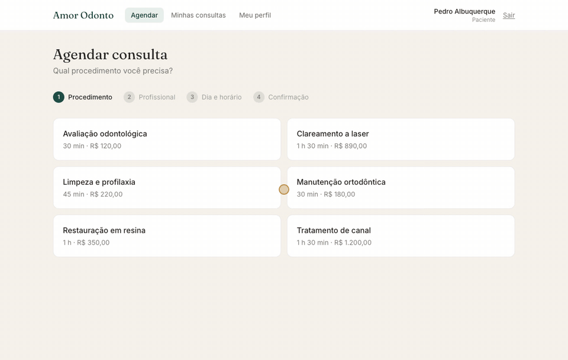

Um agendamento completo em poucos cliques: procedimento → profissional → horário livre → confirmação.

---

## O problema

Em muitas clínicas, marcar uma consulta ainda depende de telefone e WhatsApp em horário comercial. A recepção perde tempo confirmando horários, surgem encaixes duplicados, e a agenda de cada dentista fica espalhada entre cadernos e planilhas.

## A solução

O **Amor Odonto** é um sistema web de agendamento com três áreas, uma para cada público:

| | Quem usa | O que ganha |
|---|---|---|
| 🦷 **Paciente** | Quem vai ser atendido | Agenda 24 h por dia, vê preço e duração antes de confirmar, acompanha e cancela as próprias consultas. |
| 👩‍⚕️ **Profissional** | Dentistas da clínica | Agenda do dia com contato de cada paciente e controle dos próprios bloqueios (congresso, plantão, pós-graduação). |
| 🏥 **Administração** | Gestão e recepção | Visão de todos os agendamentos, cadastro de procedimentos e preços, horário de funcionamento e gestão da equipe. |

Os horários oferecidos ao paciente são **calculados em tempo real** a partir da duração do procedimento, das consultas já marcadas e dos bloqueios da clínica e do profissional. Por isso não existe encaixe duplicado: se dois pacientes disputam o mesmo horário, o segundo é avisado e escolhe outro na hora.

---

## Funcionalidades

### Para o paciente

**Agendamento guiado em quatro etapas.** O paciente escolhe o procedimento (com duração e preço visíveis), o profissional e um horário livre na semana, e confere o resumo antes de confirmar. Se o procedimento é feito por um só profissional, essa etapa é pulada. Voltar e trocar uma escolha limpa automaticamente as etapas seguintes.

<table>
  <tr>
    <td>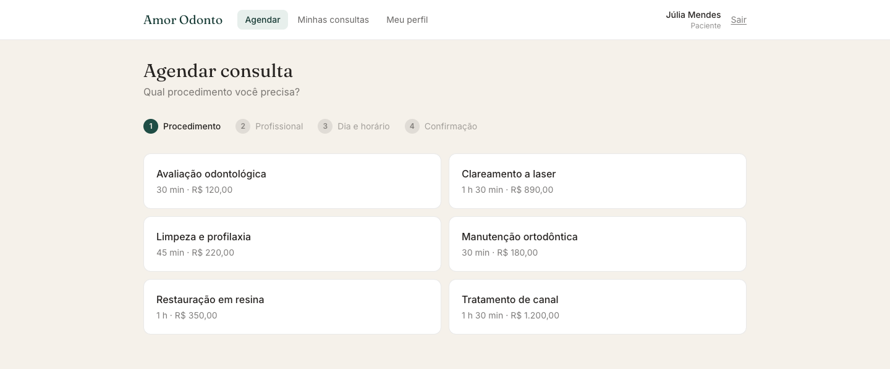</td>
    <td>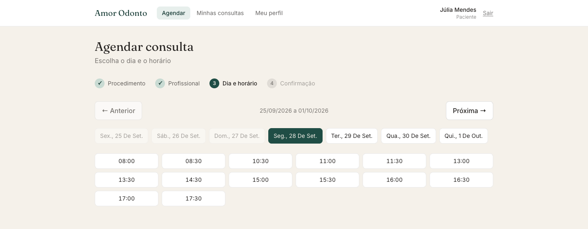</td>
  </tr>
  <tr>
    <td align="center">Procedimentos com duração e preço</td>
    <td align="center">Só aparecem horários realmente livres</td>
  </tr>
</table>

**Minhas consultas.** Próximas, anteriores e canceladas em abas separadas, com detalhes de valor, duração e contato do profissional. O cancelamento é feito em duas etapas, com motivo opcional, e o paciente recebe um e-mail avisando (o mesmo acontece ao agendar).

  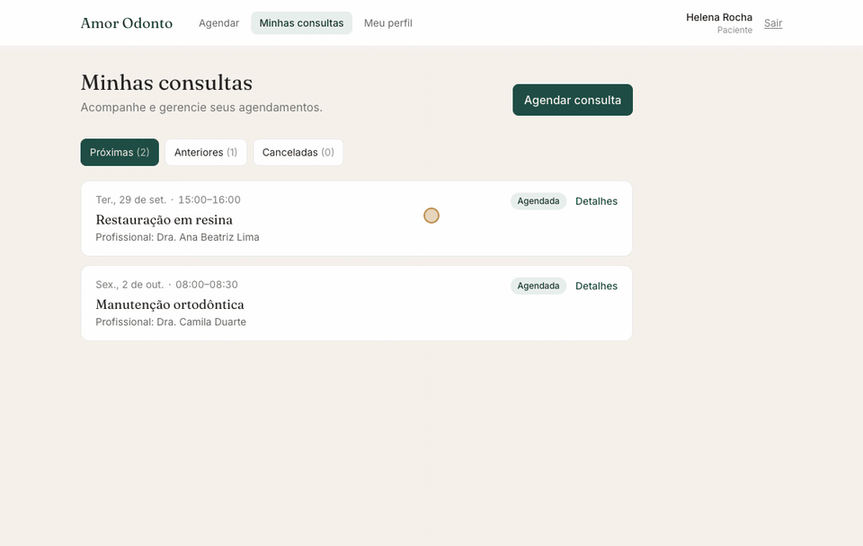

### Para o profissional

**Agenda pessoal**, com o paciente de cada consulta e o contato dele a um clique. **Bloqueios de agenda** únicos (um congresso, uma tarde de folga) ou recorrentes (toda segunda e sexta, das 7h30 às 9h). Um horário bloqueado some na hora da tela de agendamento dos pacientes.

  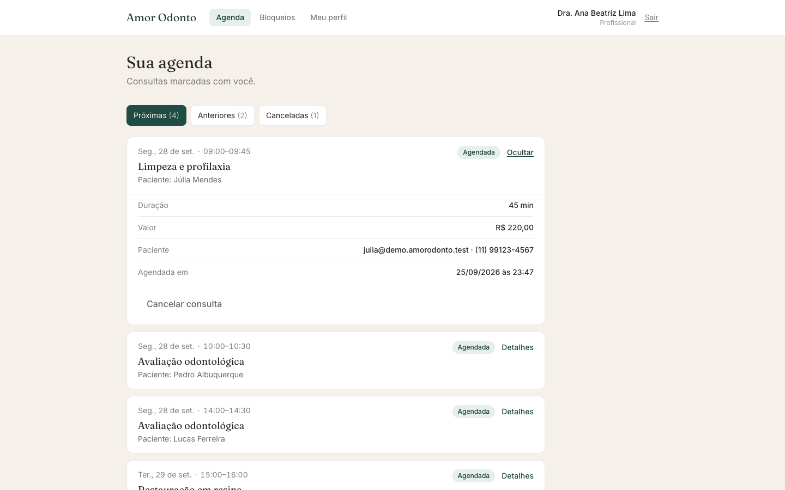

  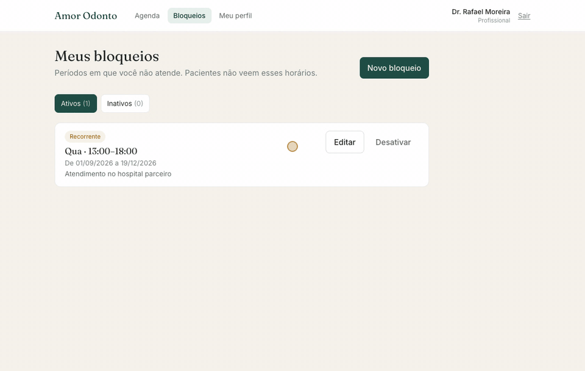

### Para a administração

- **Agendamentos da clínica**, com filtro por profissional e abas por situação.
- **Procedimentos**: nome, duração, preço em reais e quais profissionais atendem cada um; é possível desativar sem apagar o histórico.
- **Horário de funcionamento e feriados** configurados como bloqueios da clínica inteira (almoço, fim de semana, dedetização).
- **Equipe**: busca por nome ou e-mail, com promoção de paciente a profissional (e o caminho inverso) mediante confirmação.

<table>
  <tr>
    <td>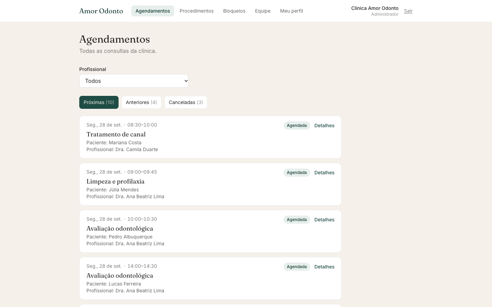</td>
    <td>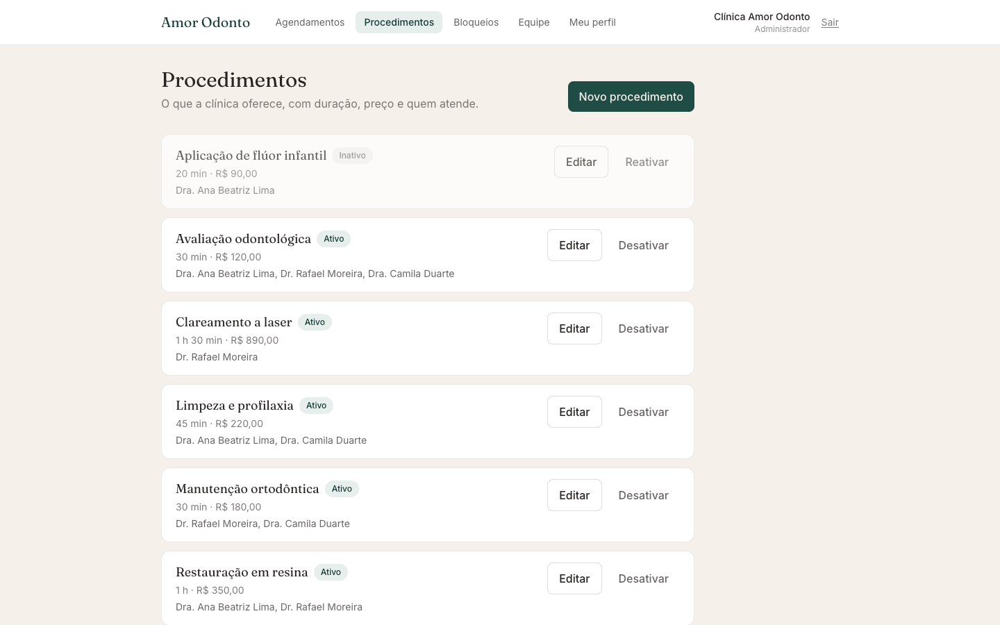</td>
  </tr>
  <tr>
    <td align="center">Todos os agendamentos</td>
    <td align="center">Procedimentos e preços</td>
  </tr>
  <tr>
    <td>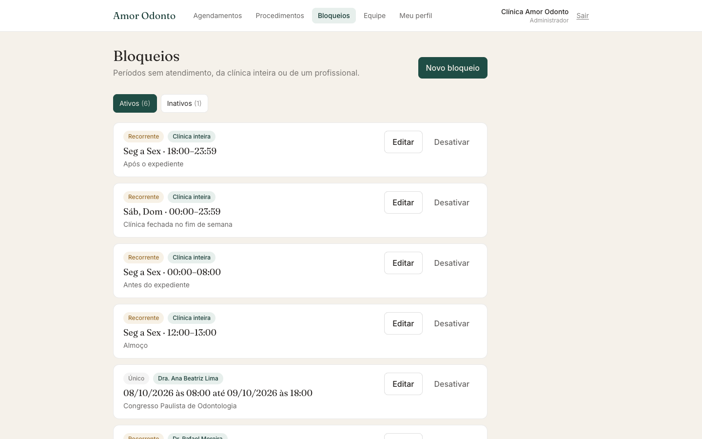</td>
    <td>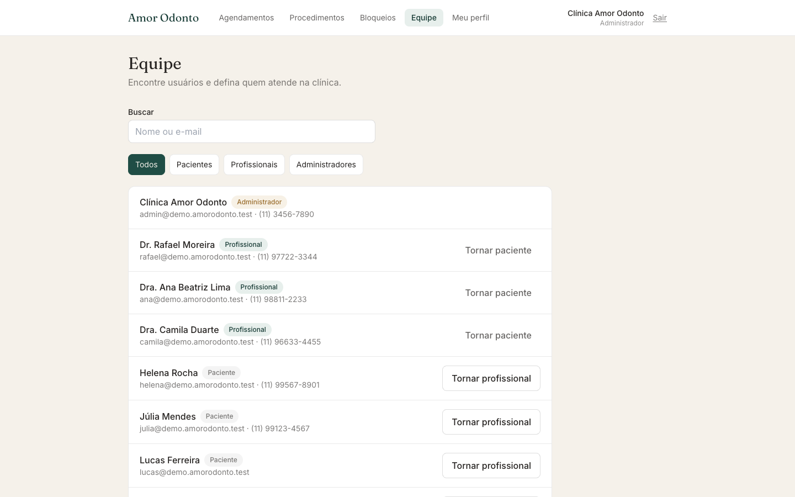</td>
  </tr>
  <tr>
    <td align="center">Funcionamento e bloqueios</td>
    <td align="center">Equipe</td>
  </tr>
</table>

---

## Experiência e qualidade

- **Identidade visual própria**: verde-pinho com acento em ocre, títulos em Fraunces e interface em Inter. Nada de template genérico: o login usa um layout dividido com a marca em destaque.
- **Funciona no celular**: navegação rolável, grade de horários adaptada e dias da semana em faixa deslizante.
- **Fuso horário da clínica**: datas e horários aparecem sempre no horário de Brasília, mesmo que o paciente acesse de outro fuso.
- **Estados bem resolvidos**: carregamento, lista vazia e erro com "Tentar novamente" em todas as telas, e avisos (toasts) após cada ação.
- **Acessibilidade**: abas com semântica ARIA, avisos anunciados a leitores de tela (`aria-live`), rótulos em todos os campos e erros de validação ligados a cada campo.
- **Segurança**: autenticação por JWT, cada rota restrita ao seu papel, sessão encerrada automaticamente quando o token expira, e cabeçalhos de segurança (CSP, HSTS, X-Frame-Options) no deploy.

  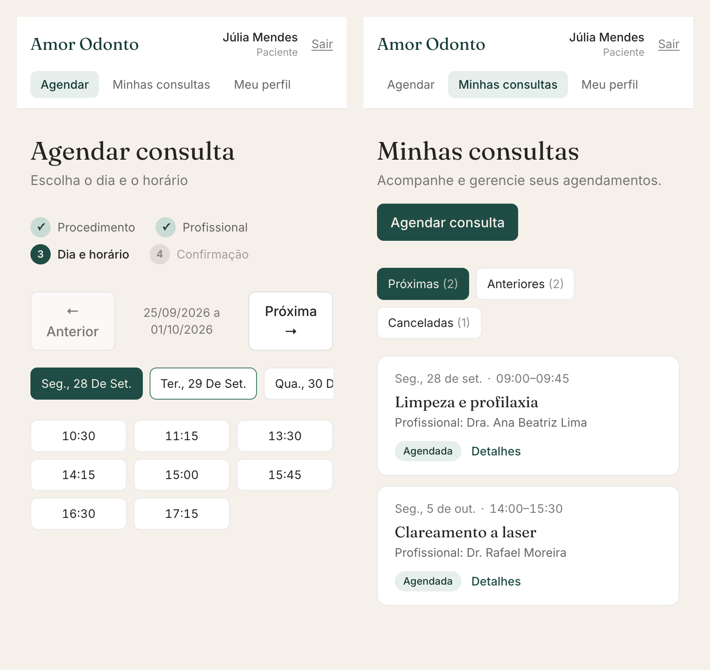

  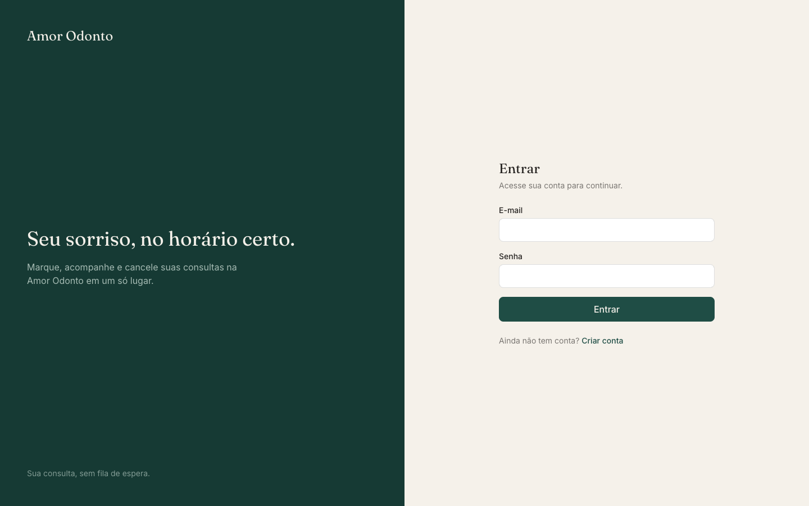

---

## Tecnologias

| Camada | Stack |
|---|---|
| Frontend (este repositório) | React 18, Vite, Tailwind CSS, React Router 6, Axios |
| [Backend](https://github.com/sauloarth/agendamentos-amor-odonto) | Node.js, TypeScript, Express, MongoDB (Mongoose), Zod, JWT, Nodemailer, Swagger/OpenAPI |
| Deploy | Render (site estático com CDN + API), blueprint em [`render.yaml`](render.yaml) |

---

## Rodando localmente

1. Suba o backend (`cd ../backend && npm run dev`), que por padrão responde em `http://localhost:3000`.
2. `npm install`
3. `cp .env.example .env` e, se necessário, ajuste `VITE_API_URL` (padrão `http://localhost:3000/api`).
4. `npm run dev` → http://localhost:5173

| Comando | O que faz |
|---|---|
| `npm run dev` | Servidor de desenvolvimento (Vite) |
| `npm run build` | Build de produção em `dist/` |
| `npm run preview` | Serve o build localmente |

### Usuários para testar

| Papel | Como obter |
|---|---|
| Paciente | Tela **Criar conta** |
| Administrador | No backend: `npm run seed:admin -- admin@exemplo.com senha123 "Admin"` |
| Profissional | Um administrador promove o usuário na tela **Equipe** |

---

## Arquitetura (resumo)

SPA com três áreas protegidas por papel (`client`, `professional`, `admin`), cada uma com sua página inicial (`/`, `/profissional`, `/admin`).

- **Camada de serviços** (`src/api/<recurso>.js`): funções finas sobre uma única instância do Axios, que injeta o token e encerra a sessão em `401`. As páginas nunca montam URLs.
- **Erros padronizados**: `getApiError` transforma qualquer erro da API em `{ message, fieldErrors, status }`, e os erros de validação aparecem ao lado de cada campo.
- **Autenticação** (`AuthContext`): valida o token salvo ao abrir o app e segura as rotas até concluir, sem redirecionamentos indevidos.
- **Dados** (`useAsync`): carregamento com descarte de respostas obsoletas; mutações aplicadas localmente com a resposta da API, sem recarregar a lista.
- **Datas** (`utils/dates.js`): tudo exibido no fuso `America/Sao_Paulo`, com dias tratados como chaves `YYYY-MM-DD`.
- **Componentes compartilhados**: `AppointmentList` (usado nas três agendas), `BlocksPage`/`BlockForm` (profissional e admin), além de `Tabs`, `Badge`, `Field` e estados de loading/vazio/erro.

### Mapa de telas × endpoints

| Área | Tela | Endpoints |
|---|---|---|
| Paciente | Agendar consulta | `GET /products`, `GET /availability`, `POST /appointments` |
| Paciente | Minhas consultas | `GET /appointments`, `PATCH /appointments/:id/cancel` |
| Profissional | Minha agenda | `GET /appointments`, `PATCH /appointments/:id/cancel` |
| Profissional | Meus bloqueios | `GET/POST /blocks`, `GET/PATCH /blocks/:id` |
| Admin | Procedimentos | `GET/POST /products`, `GET/PATCH /products/:id` |
| Admin | Bloqueios (clínica e profissionais) | `GET/POST /blocks`, `PATCH /blocks/:id` |
| Admin | Agendamentos | `GET /appointments?professional=`, `PATCH /appointments/:id/cancel` |
| Admin | Equipe | `GET /users?role=&search=`, `PATCH /users/:id/role` |
| Todos | Meu perfil | `GET /auth/me`, `PATCH /auth/me` |

Contrato completo no Swagger do backend: http://localhost:3000/api/docs.

## Próximos passos

1. **Qualidade**: ESLint + Prettier; testes com Vitest + Testing Library e MSW simulando a API (começar por `splitAppointments`, `parseCurrency`, `describeBlock` e os helpers de `dates.js`); pipeline de build/deploy.
2. Ajustes pendentes na API, listados em [`docs/BACKEND_PENDING.md`](docs/BACKEND_PENDING.md).

---

Feito por [Saulo Arthur](https://github.com/sauloarth). Quer um sistema assim para a sua clínica ou empresa? Vamos conversar.

Os nomes, e-mails e telefones das imagens são fictícios.

